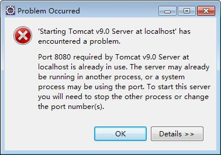
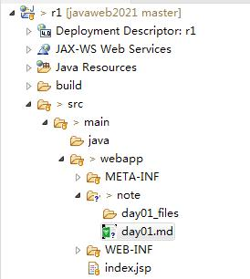

# 环境安装
## 1 . 运行出错（考试）

原因：Tomcat9.0所需要的端口8080被其他程序占用
解决：1. 在tomcat配置文件中重新更换端口；2. 结束占用8080端口的进程，重新运行
## 2. Eclipse2023创建的动态web项目的目录结构（了解）

1. src：放置源码
2. webapp：放置前端代码
3. java（Java Resources）：放置Java代码
4. webapp/WEB-INF：项目的配置信息（此文件不允许用户直接访问）
5. webapp/WEB-INF/lib：放置项目的jar包
6. webapp/WEB-INF/web.xml：项目配置文件（首页<welcome-file-list>、全局错误页面、servlet配置、过滤器配置）

# Java Web基础知识（了解）
## 1. Java技术
1. JavaSE ： Java标准开发（面向对象程序设计）
2. JavaEE ： Java企业级开发
3. JavaME ： Java移动开发
## 2. Java名词
1. SDK：软件开发工具包
2. JDK：Java开发工具包
3. JRE：Java运行时环境
4. JVM：Java虚拟机
5. JDK>JRE>JVM
## 3. B/S和C/S
浏览器和服务器
客户端和服务器
优缺点（安全性、性能、成本）
## 4. HTTP版本1.0/1.1的特点以及他们的优缺点（考试：问答）
1. HTTP1.0 一次连接一次请求
2. HTTP1.1 一次连接多次请求
3. HTTP1.1 效率更高
## 5. HTTP消息结构（重点）
### 1. 请求消息
1. MIME（多用途邮件互联网扩展类型 text/image/video/audio/application/message/multipart多部分媒体）【重点】
