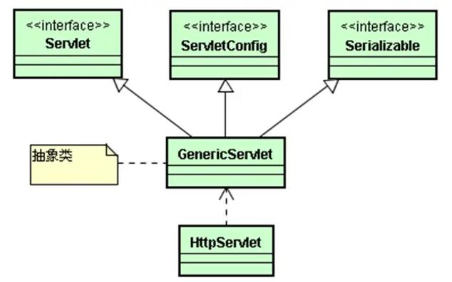
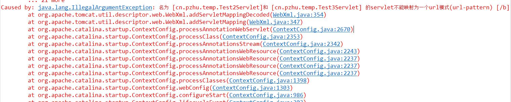

# Servlet【重点】
## 1. 什么是Servlet
1. 本质上是一个Java
2. 继承了HttpServlet（对HTTP的请求和响应的处理）

## 2. Servlet的特点
1. Java的特点
2. 功能强大（既能使用Java API，还可以使用Servlet API）
3. 性能高效（只创建一次，对象能够被反复使用；多线程（锁），每个请求都是一个线程）
## 3. Servlet的生命周期（简答题）
1. 过程：构造对象Constructor-->初始化init-->服务service（反复执行此阶段）--> 销毁（destroy）
2. 注意：
	1. 构造：启动服务器或第一次访问servlet开始构造，容器自动执行，只执行一次
	2. 初始化：构造之后立即初始化，容器自动执行，只执行一次
	3. 服务：多次被调用，Service方法不需要被复写，会被自动转发给doPost或doGET
	4. 销毁：关闭服务器或从服务器中移除项目，只执行一次
## 4. servlet的配置
1. 配置文件web.xml
	全类名（包名+类型）-->ServletName --> url pattern
2. 注解：在类的上面注解@WebServlet("/path")
3. 说明：
	1. 一个Servlet可以有多个路径@WebServlet(urlPatterns =  { "/path1", "/path2" })
	2. 一个路径关联到多个Servlet（×）服务器启动失败
	
## 5. Servlet的开发
1. 处理编码
2. 接收视图层传递的参数
3. 进行必要的数据验证和类型转换，若验证失败跳转到步骤9
	1. 是否为null
	2. 是否为""
	3. 长度length
	4. 复杂格式要求（正则表达式）Pattern.matches(reg,string)
4. 对数据进行封装
5. 初始化模型层对象，并调用模型层方法
6. 初始化结果变量保存模型层方法处理结果
7. 对必要的信息或者是标识进行保存 setAttribute()
8. 根据处理结果，如果符合预期，请求转发或者重定向到正确页面
9. 如果不符合预期，请求转发或者重定向到错误页面