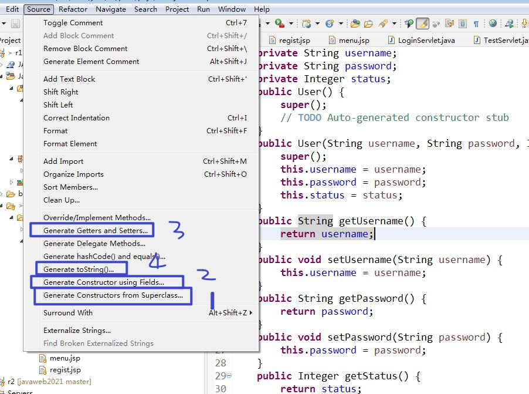

# JavaBean
## 1. 分类
1. 值JavaBean（数据封装）【考试】
	1. 具有无参构造方法（公开的） 除非是单例
	2. 所有私有成员变量类型必须是包装类型（配合框架进行操作）
	3. 私有成员变量不能以大写字母开头（框架、EL会出错）：建议与数据库字段
	4. 需要提供共有的get/set方法
	
2. 工具JavaBean(数据处理)

# EL和JSTL
## EL
1. 语法 ${}
2. 作用
	1. 进行运算（算术运算、逻辑运算、关系运算）
	2. 读取对象中的属性 ${user.username}
	3. 访问数组中的元素 ${types[0]}
	4. ${empty x} 判断x是否为null或""  ${not empty x}
	5. ${key} 表示的是读取存储对象中的key（getAttribute）【重要：考试】
		如果不指明域对象，则page--> request --> session -->application
		${pageScope.key}  ${requestScope.key} ${sessionScope.key} ${applicationScope.key}
	6. 获取当前项目根路径（相对路径-->相对服务器路径）${pageContext.request.contextPath}
	7. 显示cookie  ${cookie.cookie的名字.value}
## JSTL
1. 下载并导入jar

2. 核心库
	1. 需要在jsp页面头部使用指令进行声明prefix、uri
	2. 分支结构
		<c:if test=""></c:if>
		<c:choose>
			<c:when test=""></c:when>
			<c:when test=""></c:when>
			<c:otherwise test=""></c:otherwise>
		</c:choose>
	3. 循环结构
		1. var=x x表示正在迭代的变量名，可以使用${x}来读取正在迭代的变量值
		2. items 表示正在迭代的集合
		3. varStatus=Y Y表示迭代状态（对象） 
			* Y.index 表示迭代的索引值，从0开始：告知前端当前是第几个，开发使用
			* Y.count 表示迭代的次数：序号，从1开始
3. 格式化库 fmt