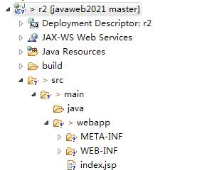
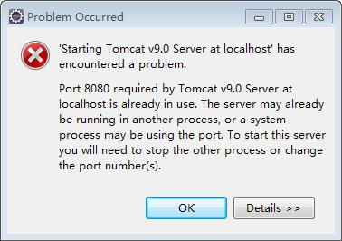

# 环境配置
## 1. eclipse2023动态web项目的目录结构

1. src：放置源码
2. src/main/java:放置Java源代码
3. src/main/webapp：放置视图层（html、js、css、jsp）代码
4. src/main/webapp/WEB-INF：放置项目的配置信息（此文件夹用户不能直接访问）
5. src/main/webapp/WEB-INF/lib：放jar包（JDBC）
6. src/main/webapp/WEB-INF/web.xml ：项目的配置文件（欢迎页面、过滤器、server映射、框架、全局信息）
7. eclipse旧版本 webapp==webcontent
## 2. JDK eclipse tomcat mysql+sqlyog 
1. tomcat 默认端口8080
2. mysql 默认端口3306（机房mysql8.0版本 端口3308 root 123456）
3. 在将项目部署到tomcat时发生以下异常，是因为什么造成的？如何解决？

问题：tomcat9.0服务器所需要的端口8080已经被使用了
解决：
	办法1：找到这个占用端口的进程，结束该进程之后重新运行。
	办法2：在tomcat的配置文件中更换其他端口。
## 3. 专有名词（了解）
1. JavaSE：Java标准开发
2. JavaEE：Java企业级开发
3. JavaME：Java移动开发（嵌入手机上的程序）
## 4. SDK、JDK、JRE、JVM
1. SDK：软件开发工具包
2. JDK：Java开发工具包
3. JRE：Java运行时环境
4. JVM：Java虚拟机
5. java.exe执行程序 javac.exe 编译程序  javadoc.exe生成帮助文档 jar.exe打包程序
## 5. B/S和C/S
1. B/S 浏览器和服务器（√）
2. C/S 客户端和服务器
## 6. HTTP的版本特点
1. HTTP无状态协议（为了能够记住某些数据cookie和session）
2. HTTP1.0 一次连接一次交互
3. HTTP1.1 一次连接多次交互（效率更高）
## 7. HTTP消息（了解、熟悉）
### 1. 请求消息
1. MIME：多用途邮件互联网扩展类型（text、image、audio、video、message、application、multipart）
2. accept：客户端能够接收的类型
3. host：请求的主机地址（域名、ip地址：端口号）
4. referer：【重要】防盗链
5. cookie：保存信息
### 2. 响应信息
1. content-type：告知客户端响应的内容类型（附带编码）
2. cache-control:no-cache; 告知客户端此响应内容不能缓存
3. refresh：定时刷新（定时跳转）
### 3. 服务器状态码
1. 1XX 继续发送信息给服务器
2. 2XX 服务器正常
3. 3XX 重定向（继续完成后续请求）
4. 4XX 客户端异常
5. 5XX 服务器异常

# 前端开发技术
## HTML
1. 表单(考试 5分)
2. 超链接（地址的使用：绝对路径、相对路径、相对服务器路径【重点】）
## CSS
1. 行内样式、内部样式、外部样式
2. 常用选择器：id、class、E F、E>F、E+F、E~F
3. 常用样式：内边距padding、外边距、背景色、颜色、字体
## JS
1. 表单验证【重点】
	1. 是否为空 v == ""
	2. 是否是数字 isNaN(v)
	3. 长度是否满足要求 v.length < 6
	4. 格式是否符合要求 /^...$/.test(v)
2. 事件
	1. onclick
	2. onchange
	3. onsubmit
## jQuery
1. 基于jQuery的Ajax
2. 表单验证

