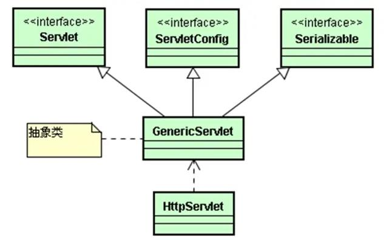
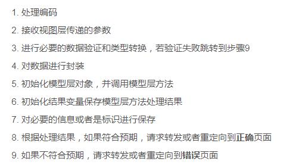
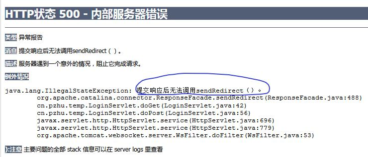

#1. 内置对象
##1. request session application存储对象
1. 存储的范围（有效的作用域） page、request、session、application
2. 存储作用域
	1. page：页面本身（几乎不使用）
	2. request：一次请求
	3. session：一次会话（与服务器建立链接开始，与服务器断开）【重要】
	4. application：服务器有效（从服务器启动到关闭）
		特点：1. 所有用户共享（记录访问量） 2.一般用于存储服务器配置信息
3. 对数据进行CRUD
	1. 增加 setAttribute(String key,Object 需要存储的值)
	2. 删除 removeAttribute(String key)
	3. 修改 setAttribute(String key,Object 需要存储的值)
	4. 查询 Object getAttribute(String key)
		1. 注意：可能需要进行类型转换
		2. 注意：可能发生类型转换异常，需要try catch进行异常捕获
4. 【重要】session
	1. 服务器超时断开（被动）
		1. web.xml中进行配置
		2. 手动使用代码控制 setMaxInactiveInterval​(int interval)
			1. 用于指定请求的间隔超时时间
			2. 单位是秒
			3. 时间是0或负数，则永不超时
	2. 强制session失效 session.invalidate(); 应用：注销、退出
## 2. page pageContext config exception
1. page相当于页面本身 this
2. pageContext 通过这个对象能够访问其他对象  EL表达式 ${pageContext.request}
3. config 用来进行配置信息
4. exception 保存异常信息（只有错误处理页面才有此对象）

# 2. 【重要】Servlet
## 1. 什么是Servlet
1. 本质上是一个Java
2. 能够处理HTTP请求（继承了HttpServlet）

3. 特点
	1. Java的特点的Servlet都具备
	2. 功能强大：不仅调用Java API 还可以调用Servlet API
	3. 性能高效：Servlet对象只初始化一次，采用多线程来处理请求
## 2. Servlet的创建与配置
1. 路径的配置
	1. @WebServlet("/路径")
	2. web.xml配置
2. 注意
	1. 1个Servlet可以有多个路径 @WebServlet(urlPatterns = { "/路径1", "/路径2" })
	2. 1个路径不能映射到多个servlet，会抛出java.lang.IllegalArgumentException
## 3. Servlet生命周期
1. 生命周期 constructor(构造方法)-->init(初始化)-->service（运行：反复执行）-->destroy（销毁）
2. 构造、初始化：都由服务器容器执行，只执行1次
3. 销毁：都由服务器容器执行，只执行1次（关闭服务器或将项目从容器中移除）

# 3. 实践
## Servlet开发步骤

## 异常

原因：可能出现了多次重定向
解决：检查是否分支不完整，在分支末尾增加return，结束代码