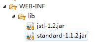
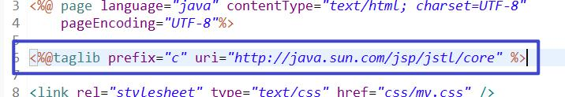

# JavaBean
## 1. 分类
1. 值JavaBean（POJO、映射类）只有数据（私有成员）
	1. 成员变量必须私有的
	2. 成员变量首字母不能大写【使用框架时可能无法找到大写开头的变量】
	3. 需要有无参构造方法、有参构造（一般要求public） 单例设计模式private
	4. 成员变量必须是包装类型（int--Integer）【方便框架使用】
	5. 提供public修饰的get/set方法
2. 工具JavaBean（模型：业务层、持久层）

# EL表达式
1. 语法 ${}
2. 作用
	1. 进行运算:算术运算、逻辑运算、关系运算、条件运算 ${1+1}
	2. 读取对象中的属性 ${user.username}
	3. 读取集合/数组中的值 ${array[index]}
	4. 判空 ${empty x} 判断x是否为null或""   ${not empty x} 
	5. ${pageContext.request.contextPath} 上下文路径（webapp/java）：将相对路径转换为相对服务器路径
	6. 读取域对象（page、request、session、application）中的信息 ${msg}
		说明：如果不指定域，从小到大依次检索
		${pageScope.msg} ${requestScope.msg} ${sessionScope.msg} ${applicationScope.msg}
	7. 读取cookie   ${cookie.cookie的名字.value}
# JSTL 
1. 是什么：JSP标准标签库
2. 干什么：使用标签来代替Java代码
3. 怎么用？
	1. 导入库
	
	2. 在页面声明
	
3. 常用的标签
	1. 分支语句
		1. <c:if test="条件">执行内容</c:if>
		2. 多分支
		<c:choose>
			<c:when test="条件">执行内容</c:when>
			<c:when test="条件">执行内容</c:when>
			<c:otherwise test="条件">执行内容</c:otherwise>
		</c:choose>
	2. 循环语句<c:forEach var="x"></c:forEach>
		1. var=x，x表示正在迭代的变量名，可以输出当前的迭代值${x}
		2. items=x,x表示正在迭代的集合（数组、list）
		3. varStatus=x,x表示正在迭代的状态（对象）
			x.index--迭代的索引，从0开始
			x.count--迭代的次数，从1开始
		
