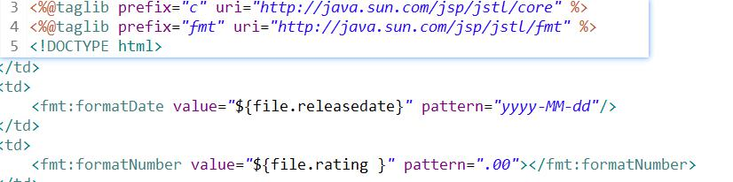

# 1. 导航栏
1. 视图层（负责显示）
	```
		<div style="text-align: center;margin-top: 50px;">${bar}</div>	
	```
	
	增加CSS样式
	
2. 业务层
	负责初始化bar，并且构造导航栏链接
	
	
3. 控制器
	负责提供bar，存储到session域对象
	
	
# 2. 邮件发送
1. 创建loginemail.jsp

2. 修改视图层

3. 增加ajax异步请求

4. 增加发送邮件接口

5. 导入jar包

6. 创建邮件发送工具类
生成授权码


7. 实现发送邮件业务层

8. 实现用户信息查询持久层

9. 创建邮件发送控制器

10. 实现发送邮件逻辑

11. 创建邮件登录控制器

12. 实现邮件登录


# 3. 文件下载和上传
## 1. 文件下载
1. 导包file
2. 修改下载页面

3. 执行下载


## 2. 文件上传
1. 设计页面

2. 实现控制器
	1. 增加注解
	
	2. 实现上传
	

# 4. JSTL格式化库


