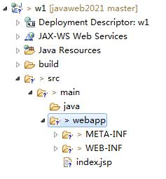
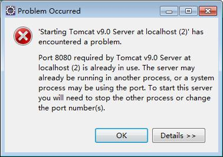

# 1. 环境配置
## 1. 目录结构

1. src:放置源代码
2. src/main/java：放置java的代码（servlet、java类、接口）
3. src/main/webapp：放置前端（jsp、html、css、js、img）
4. ../webapp/WEB-INF：放置web项目配置信息（不允许用户直接访问）
5. .../WEB-INF/lib：放置jar包（JDBC）
6. .../WEB-INF/web.xml：项目的配置文件（欢迎页面welcome-file-list、过滤器、servlet、框架配置）
## 2. Tomcat、mysql
1. tomcat 端口8080
2. mysql 3306  （本次课程mysql8 端口3308 root 123456）
3. 下面发生了什么错误？怎么解决？

原因：tomcat9.0服务器所需要的端口8080已经被使用了
解决：方法1：结束占用端口的程序，再重启Tomcat；方法2：更换其他端口

# 2. Java Web基础知识
## 1. Java体系（了解）
1. JavaSE java标准开发
2. JavaEE java企业级开发（javaweb、框架）
3. JavaME java移动开发（×）
## 2. SDK、JDK、JRE、JVM
1. SDK：软件开发工具包
2. JDK：java开发工具包
3. JRE：java运行时环境
4. JVM：java虚拟机
## 4. HTTP版本
1. HTTP是无状态协议（session【服务器】和cookie【客户端】来记录状态或信息）
2. HTTP1.0 一次连接一次交互
3. HTTP1.1 一次连接多次交互（效率更高）
## 5. HTTP消息
### 1. 请求消息
1. MIME（text、image、application、video、audio、message、multipart）
2. accept：客户端能够接受的MIME
3. host：请求资源的主机和端口号（代理有可能不一致）
4. referer：【重要】防盗链
### 2. 响应消息
1. 服务器响应状态码
2. content-type：响应的内容类型（特殊：验证码）+附带编码（解决乱码）
3. 缓存控制（三种）
4. location一般和重定向一起使用

# 3. 前端开发基础
## 1. HTML
1. 超链接+路径（绝对路径、相对路径、相对服务器路径）
2. 表单（考试）
## 2. CSS
1. 常用选择器
2. 常用样式
3. 浮动和定位
## 3. JS
1. 表单验证（是否为空 v=="" 是否是数字 isNaN(v) 长度是否符合要求v.length<6 格式是否符合要求-正则表达式）
2. 事件响应（鼠标单击onclick 值被改变失去焦点onchange 表单被提交onsubmit） 