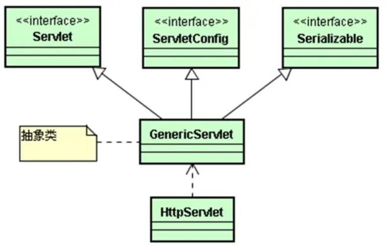

# 1. 内置对象
##1. request、session、application 存储对象
1. 作用域：page、request、session、application
2. 作用域解释：
	1. page：页面本身（不会使用）
	2. request：一次请求（浏览器发出到响应就结束【默认：表单提交数据】）
	3. session【重要】：一次会话（与服务器建立连接开始，直到断开连接）
	4. application：（几乎不太使用）服务器级存储（服务器启动一直到关闭）：所有用户共享
3. 重要方法（增删改查）
	1. 增加 setAttribute(String key,Obejct 存储的内容);
	2. 删除 removeAttribute(String key);
	3. 修改 setAttribute(String key,Obejct 新的内容);
	4. 查询 Object getAttribute(String key);
		1. 所有得到的类型都是Object，需进行类型转换
		2. 可能产生类型转换异常，可能需要进行异常捕获try catch
4. 其他重要方法
	1. 通过request能够得到session：request.getSession()
	2. 通过request能够得到application：request.getServletContext()
5. session存储对象
	1. 被动：超时失效
		1. 提高服务器效率
		2. 提高安全性
		3. 实现 
			1. 在web.xml中进行配置
			2. session.setMaxInactiveInterval(秒); 0或负数表示永不失效
	2. 主动：强制失效
		session.invalidate()  应用：退出、注销
## 2. page、pageContext、config、exception
1. page：相当于页面本身，this
2. pageContext：通过此对象找到其他对象  EL表达式 ${pageContext.request}
3. config:配置
4. exception：只有isErrorPage="true"才会出现

# 2. Servlet技术【核心】
## 1. 什么是Servlet？
1. 本质上一个Java类
2. 能够处理HTTP请求（继承了HttpServlet类）

3. Servlet的体系结构
## 2. Servlet特点
1. java的特点都有
2. 功能强大：能够调用Java API，还能够调用Servlet API
3. 性能高效：只初始化一次，多线程提供服务（锁）