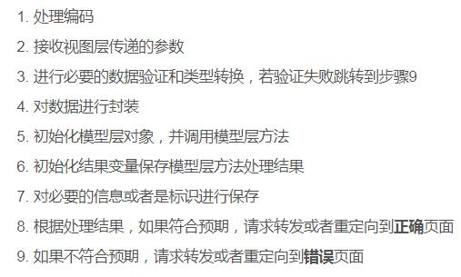
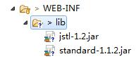

# 1. JavaBean
## 1. 分类
1. 值JavaBean（封装数据POJO）【考试：根据表编写映射类】
	1. 表名直接映射为类名（首字母大写）
	2. 所有字段映射为私有成员
	3. 私有成员变量名首字母不能大写（后续框架开发中可能无法找到大写的成员）
	4. 提供公开的无参构造方法或有参构造方法
	5. 提供公开的get/set方法
	6. 【重要】私有成员类型必要使用包装类型（int--> Integer）
		float-->Float  double-->Double char-->Character
2. 工具JavaBean（处理数据）--> 【表现层】、业务层、持久层

# 2. Servlet开发

# 3. EL表达式
## 1. 概念
${表达式}   $() jquery
## 2. 使用
1. ${运算} 算术运算、逻辑运算、关系运算、条件运算${a>b?c:d}
2. ${对象.属性} 访问对象中的属性值 ${user.password}
3. ${数组/集合[索引]} 访问数据或集合中的元素
4. 判空 ${not empty x} 判断x是否为null或""
5. ${pageContext.request.contextPath} 获取web项目根路径：将相对路径转为绝对路径
6. 【重要】获取域对象中的值 getAttribute
	说明：可以不指定域对象${msg}，表示依次查找不同的域对象page-->request-->session-->application
			${sessionScope.msg}
7. 读取cookie的值  ${cookie.cookie的名字.value}	

# 4. JSTL
## 1. 概述
1. 下载和使用

2. 在需要使用的页面进行声明
<%@taglib prefix="c" uri="http://java.sun.com/jsp/jstl/core" %>
## 2. 核心库
1. 分支
	* 单分支 <c:if test="条件"> 执行的内容 </c:if>
	* 多分支 
		<c:choose>
			<c:when test="条件"> 执行的内容 </c:when>
			<c:when test="条件"> 执行的内容 </c:when>
			<c:otherwise> 执行的内容 </c:otherwise>
		</c:choose>
2. 循环
	<c:forEach var="x" items="集合" varStatus="s"></c:forEach>
	 * var="x" x=a  ${x}输出正在迭代的元素的值
	 * items 需要迭代的集合
	 * varStatus="s"
		1. s.index 迭代的索引，从0开始
		2. s.count 迭代的次数，从1开始【序号】
	
## 3. 格式化库

# 4. 实验
reg.test(string)
Pattern.matches(reg,string)

