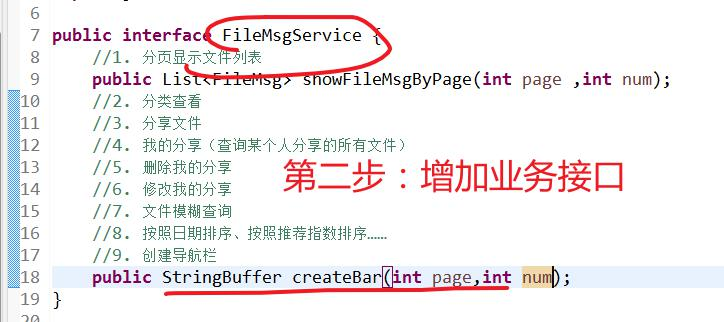
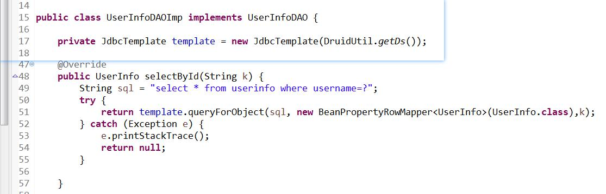
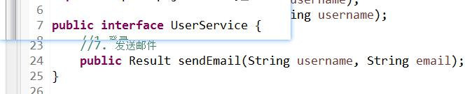
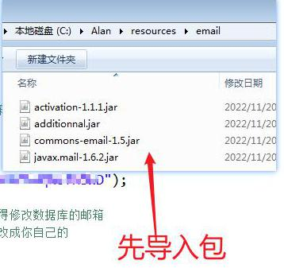
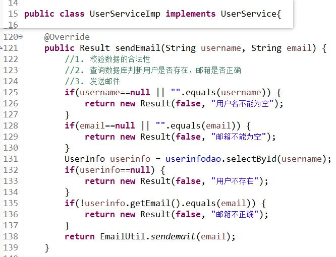

# 1. 导航栏
## 1. 视图
1. 修改视图
2. 增加元素，显示导航栏
## 2. 控制器
1. 修改ShowFileMsgServlet，提供bar
2. bar具体生成应该交给模型model
## 3. 业务层
1. 增加业务层接口FileMsgService
2. 实现接口FileMsgServiceImp（数据校验、业务处理）
	1. 数据校验
	2. 业务处理
	3. 完善控制器
## 4. 完善每页显示的条数

# 2. 邮箱登录
## 1. 增加邮箱登录的页面

## 2. 增加ajax异步请求

## 3. 业务层
1. 完善查询用户信息的持久层

2. 增加发送邮件的业务接口

3. 实现发送邮件的工具类

4. 实现业务层接口

## 4. 实现控制器
1. 创建控制器并初始化业务层接口

2. 执行邮件发送

3. 创建邮箱登录的控制器

4. 实现登录

# 3. 文件上传和下载
## 1. 文件下载
1. 导入jar包

2. 修改下载界面show.jsp

3. 创建下载控制器

4. 实现下载

## 2. 文件上传（实例）
1. 上传文件

2. 实现控制器

3. 需要将路径存储到数据库中，用于之后的下载

