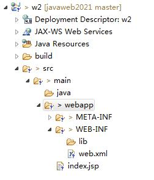
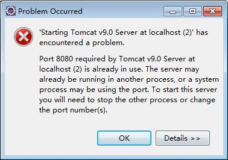

# 1. 环境安装
## 1. eclipse项目目录结构

1. src/main/java：放置java源代码（Java Resources）
2. src/main/webapp：放置视图层代码（html/css/js/img/jsp）webContent
3. webapp/WEB-INF:项目信息（用户不能直接访问）
4. webapp/WEB-INF/lib：放置项目所需jar包（JDBC）
5. webapp/WEB-INF/web.xml：项目配置文件

## 2. 端口
1. tomcat默认端口8080 
2. mysql默认端口3306  【mysql8--3308、root、123456】
3. 下面产生了什么错误？【考试：辨析题】

原因：Tomcat9.0所需要的端口8080已经被使用了
解决：办法1：在tomcat的配置文件中更换端口号。
	办法2：找出占用端口的程序，结束程序之后重新启动。

## 3. JDK（SDK、JDK、JRE、JVM）
1. sdk：软件开发工具包
2. jdk：java开发工具包
3. jre：java运行时环境
4. jvm：java虚拟机
5. jdk>jre>jvm

## 4. Java技术体系
1. JavaSE：java标准开发
2. JavaEE：java企业级开发（javaweb、SSM）
3. JavaME：java移动开发

## 5. C/S和B/S

# 2. Java Web基础知识
## 1. HTTP协议
1. HTTP是无状态协议（没有记忆能力）解决：cookie【客户端】、session【服务器】
2. 版本：1.0 和 1.1 
3. HTTP1.0 一次连接一次交互
4. HTTP1.1 一次连接多次交互（效率更高）
## 2. HTTP请求消息
1. MIME：text、application、image、video、audio、message、multipart
2. accept：客户端能够接收的类型
3. cache-control：缓存控制 max-age、no-cache
4. cookie：保持必要的信息
5. Referer:追踪网页访问来源（防盗链）
## 3. HTTP响应消息
1. 服务器状态码（1XX、2XX（200）、3XX（重定向location）、4XX（客户端404）、5XX（服务器错误500））
2. content-type：响应的内容类型（附带编码）【解决响应乱码】
3. expires：有效期（过期时间）
4. 缓存控制（什么是浏览器缓存？为什么有缓存？什么情况下不需要缓存？【验证码】）

## 4. 前端开发基础
### 1. HTML
1. 表单（考试）
2. 超链接和路径（绝对路径、相对路径、相对服务器路径）
### 2. CSS
1. 常用选择器（class、id、组合选择）
2. 常用样式
### 3. JS
1. 表单验证（v==""是否为空 isNaN(v)是否是非数字 v.length<.. 正则表达式）
2. 鼠标单击（onclick）值被改变并且失去焦点（onchange）表单提交（onsubmit）