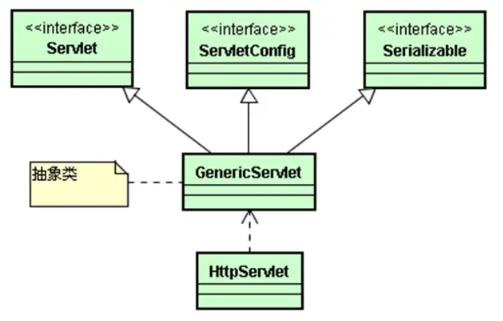

# 1. 内置对象request、session、application【存储对象】
1. 存储范围（作用域） page、request、session、application
2. 解释：
	1. page 范围是当前页面，不使用
	2. request范围一次请求（表单提交数据）
	3. session【重要】范围一次会话（与服务器建立链接开始，直到断开连接）
	4. application范围服务器级有效（服务器启动，服务器关闭；所有用户共享） 服务器配置、访问量
3. 数据存储（增删改查）【重要】
	1. 增加 setAttribute(String key,Object 存储的内容)
	2. 删除 removeAttribute(String key)
	3. 修改 setAttribute(String key,Object 新的内容)
	4. 查询 Object getAttribute(String key)
		1. 可能需要进行类型转换
		2. 可能产生类型转换异常，使用try  catch进行捕获
4. request可以获得其他存储对象
	1. session： request.getSession()
	2. application: request.getServletContext()
# 2. 内置对象page pageContext config exception
1. page 页面本身
2. pageContext 通过这个对象可以获得其他对象  ：EL表达式 ${pageContext.request}
3. config 配置
4. exception 只有isErrorPage="true"，才会存在

# Servlet
## 1. 什么是Servlet
1. 本质上是Java（Java API）
2. 能够处理Http请求（继承了HttpServlet这个类）（Servlet API）

## 2. Servlet的特点
1. java的特点
2. 功能强大：既可以调用Java API还可以调用Servlet API
3. 性能高效：实例只创建一次；多线程服务【线程安全--加锁】

