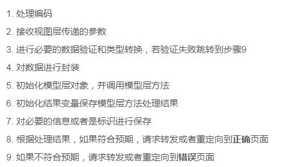
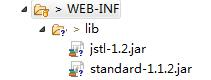

# 1. Servlet
## 1. Servlet配置(配置路径、初始值)
1. web.xml中进行配置（Servlet3.0之前必须）
	servlet：全类名-->servlet name（名字）
	servlet mapping：名字 --> 路径
2. 注解@WebServlet("/path")
3. 注意
	1. 路径以“/”开头，当前web根路径【不是服务器根路径】
	2. 一个路径只能映射一个servlet
	```
		Caused by: java.lang.IllegalArgumentException: 名为 [cn.pzhu.temp.Test1Servlet]和 [cn.pzhu.temp.Test2Servlet] 的servlet不能映射为一个url模式(url-pattern) [/aaa]
	```
	3. 一个servlet可以有多个路径
	```@WebServlet(urlPatterns = { "/c1", "/c2", "/c3" })```
## 2. Servlet的生命周期【简答题】
1. 创建constructor：只执行一次，由容器自动执行，服务器启动或第一次访问servlet
2. 初始化init：只执行一次，由容器自动执行，创建对象之后立即执行
3. 服务service：反复执行，接收到请求就会执行
4. 销毁destroy：只执行一次，由容器自动执行，服务器关闭，web应用被移除

## 3. 开发



# 2. JavaBean
## 1. 分类：值JavaBean【pojo、映射类】（封装数据/get/set） 、 工具JavaBean（数据处理）
## 2. 值JavaBean的编写要求
	1. 表名--> 类名（首字母大写）
	2. 字段名-->成员变量（首字母必须小写）【框架发生异常】
	3. 字段类型--> 变量类型（必须是包装类型）
	4. 提供构造方法（无参、有参）
	5. 提供public修饰的get/set方法
## 3. 工具类JavaBean（三层架构）

# 3. 实践
1. login.jsp登录
2. LoginServlet接收数据，并且判断是否能够登录
3. index.jsp 登录成功之后的首页（需要动态显示菜单）
4. error.jsp 登录失败的错误消息

# 4. EL
## 1. 概述
1. 表达式语言
2. ${表达式}
## 2. 使用
1. 运算：算数运算、比较运算、逻辑运算、条件运算
2. 判空：${empty x} 判断x是否为null或""   ${not empty x}
3. 读取对象的属性${对象.属性}
4. 读取集合/数组中的值 ${array[i]}  ${list[i]}
5. 获取web根路径 ${pageContext.request.contextPath}
6. 读取域对象中的信息 ${sessionScope.msg }
	说明：${msg}:依次从小到大查找 page-->request-->session-->application
7. 读取cookie  ${cookie.名字.value}

# 5. JSTL
## 1. 概述
1. JSP标准标签库
2. 导入JSTL的jar包

3. 需要在JSP页面进行声明
## 2. 核心库
1. 分支
	1. 单分支 <c:if test="">执行内容</c:if>
	2. 多分支
		<c:choose>
			<c:when test="">执行内容</c:when>
			<c:when test="">执行内容</c:when>
			<c:otherwise test="">执行内容</c:otherwise>
		</c:choose>
2. 循环
	<c:forEach var="x" items="" varStatus="y">${x}</c:forEach>
	1.  var="x" 正在迭代的元素会保存在x中，x又被存储到page域 ${x}
	2.  items="需要迭代的集合" 必须
	3.  varStatus="y" y表示的是迭代状态信息对象
			y.index 表示迭代的索引，从0开始
			y.count 表示迭代的次数，从1开始【表格的序号】
# 实验
1. 正则表达式  reg.test(email)
2. Java    Pattern.matches(reg,email)