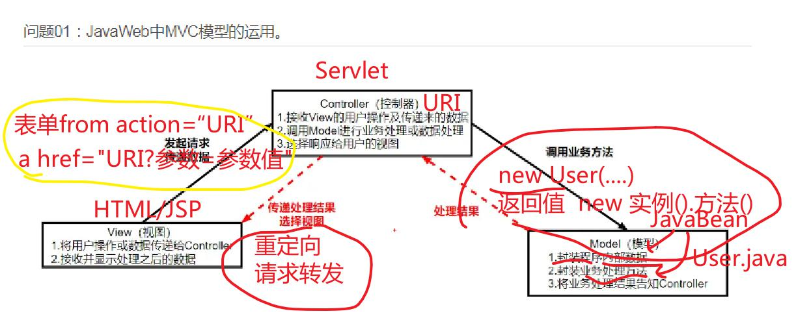

# 1. MVC

# 2. Filter
## 1. 概念
1. 本质上是Java（*.java）
2. 区别：
	1. 实现Filter接口（Tomcat8.0及以前）
	2. 继承HttpFilter类（Tomcat9.0新特性）
## 2. 体系结构（面试）
1. 只处理Http类型的请求和响应，选择继承HttpFilter类，不需要进行类型转换，提高开发效率、减少代码量
2. 希望Filter更灵活、处理范围更广，需要直接实现Filter接口
3. 过滤器已经继承了某个类，只能选择1（Java不允许多继承，防止菱形继承问题出现）
## 3. 作用
1. 能够在请求到达目标资源之前对request进行处理
2. 能够在响应到达客户端之前对response进行处理
3. 能够决定是否继续访问后续资源
## 4. 应用
1. 得到请求头、请求行的信息：黑名单、白名单、防盗链
2. 得到参数的值：敏感词过滤
3. 设置请求响应编码：统一网站的编码【考试】
4. 读取cookie：自动登录
5. 写入头信息：禁止某一类文件缓存、【扩展】制定某些文件可以跨域
6. 写入cookie：给客户端附带信息
7. 决定是否放行
	1. 放行 chain.doFilter(request, response);super.doFilter(req, res, chain);
	2. 阻止（去其他地方） ：重定向（√）、请求转发
## 5. 创建和配置
1. 创建
2. 配置
	1. 注解@WebFilter(urlPatterns = {"path1","path2",""})
	2. Web.xml
	
3. 过滤范围
	1. /* 过滤所有文件：统一网站编码
	2. 某一类文件，eg.所有的jsp文件：*.jsp
	3. 某一个文件夹下的所有文件，eg.所有的笔记 /note/*
	4. 某个指定的文件，eg. 个人信息页面  /userinfo.jsp
	5. 注意：同一个过滤器允许设置多个过滤范围