# 1. 分页显示
## 1. 视图 没有修改
## 2. 模型
1. 创建工具类
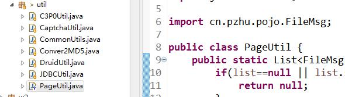
2. 实现工具类
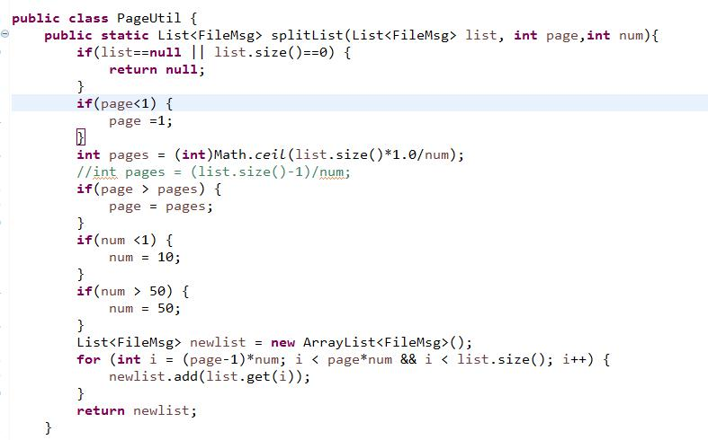
## 3. 控制器
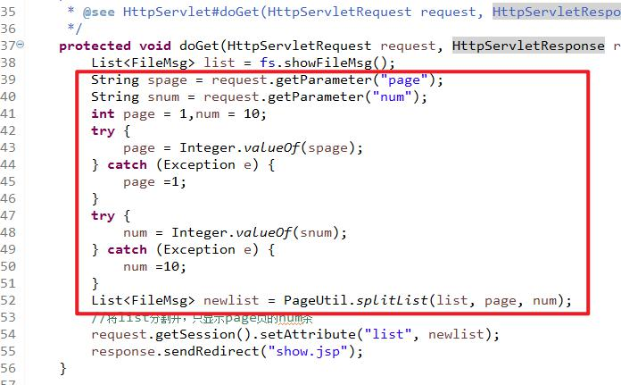

# 2. 导航栏
## 1. 视图
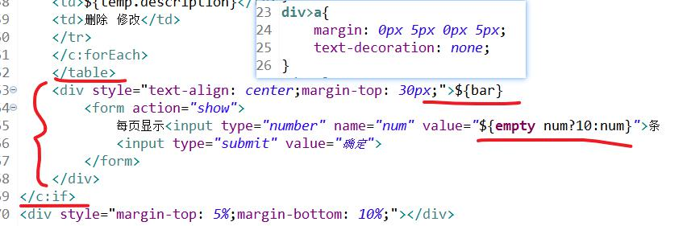
## 2. 模型
PageUtil中增加新方法
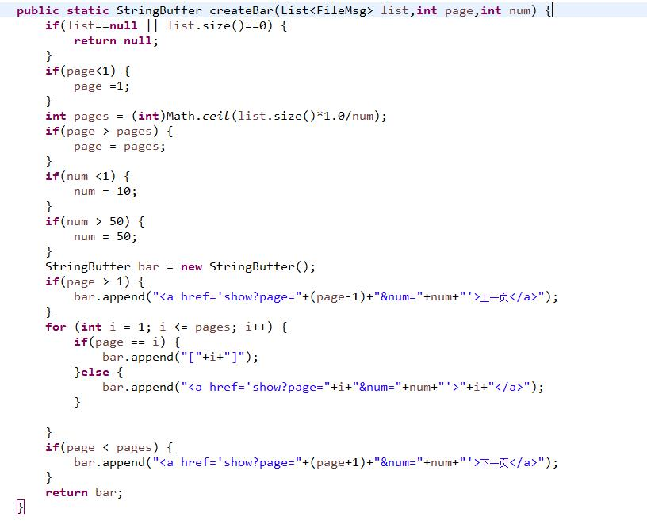
## 3. 控制器
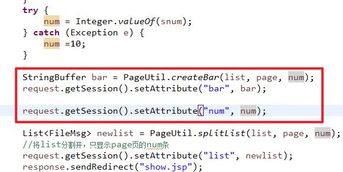

# 3. 文件上传和下载
## 1. 文件下载修改视图
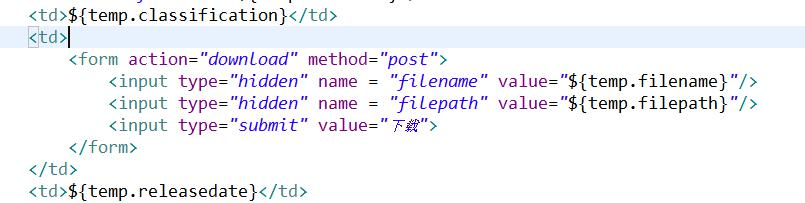
## 2. 创建下载控制器
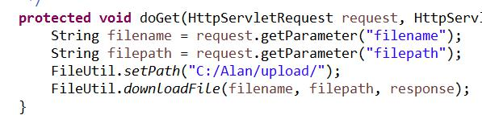

# 4. 邮件发送
1. 在login.jsp增加入口
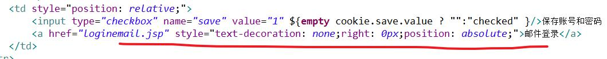
2. 创建loginemail.jsp
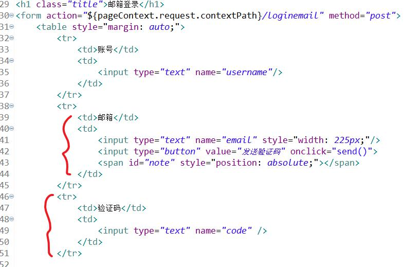
3. 增加ajax代码
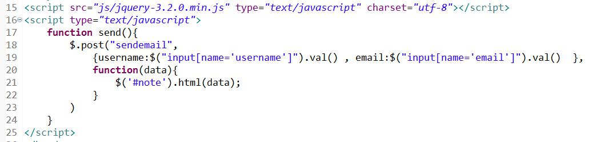
4. 实现查询用户信息的持久层
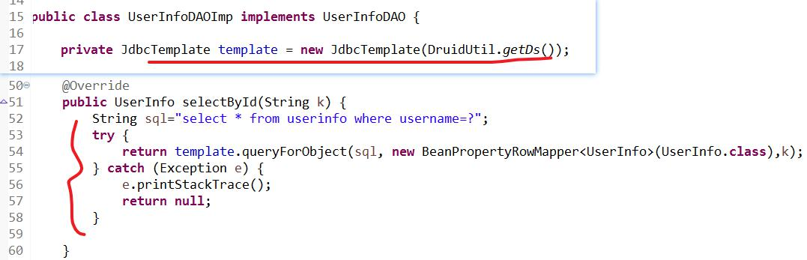
5. 导入邮件发送的jar包
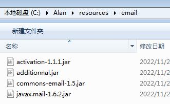
6. 实现邮件发送的工具类
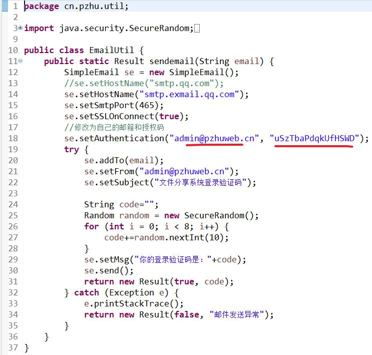
7. 新增邮件发送业务接口
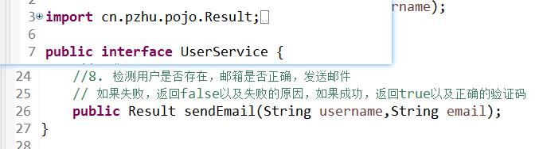
8. 实现邮件发送的业务
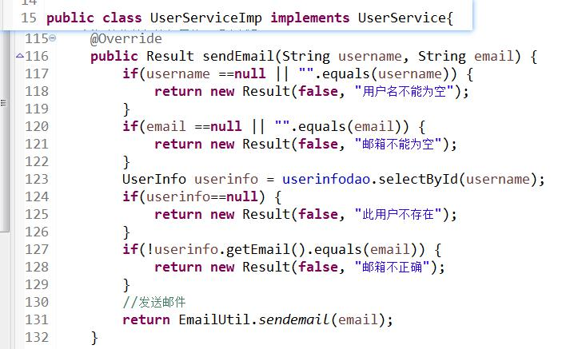
9. 创建发送邮件的控制器
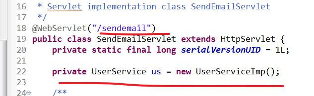
10. 实现邮件发送
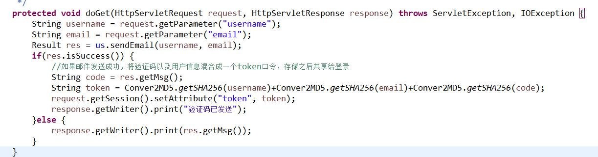
11. 实现登录控制器
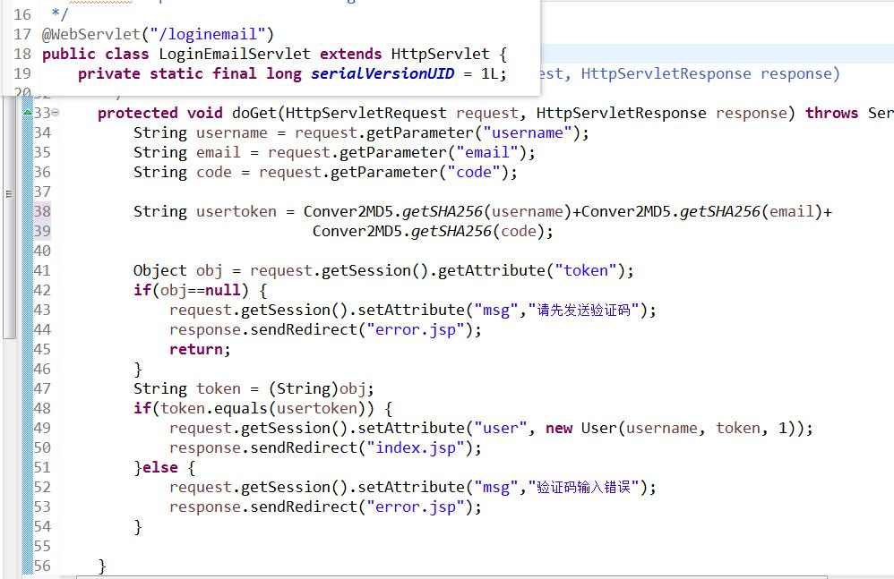
